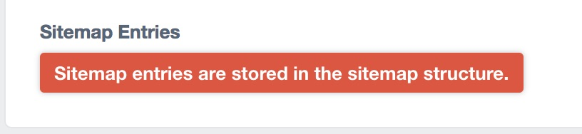

# Craft Notes Field

Add notes throughout the CMS as fields.

## Installation

### Step 1 - Upload the files

Extract the Notes Field zip somewhere on your computer. Upload the 'notesfield' folder (inside the extracted .zip folder) to your 'craft/plugins' folder within your Craft CMS install.

### Step 2 - Install the plugin

With your files uploaded, log into your Craft site’s Control Panel (located at http://example.com/cms), and navigate to Settings → Plugins. Click the “Install” button next to "Notes Field".

## Create a note

To create a note, follow the Craft [field guide](https://craftcms.com/docs/fields). Enter you text in the "Notes" textarea.

## Options

### Hide Field Label

Hide the field label above the field. Useful when adding a note to a matrix block.

### Types

**Default**

**Instructions**

**Notice**

**Warning**

